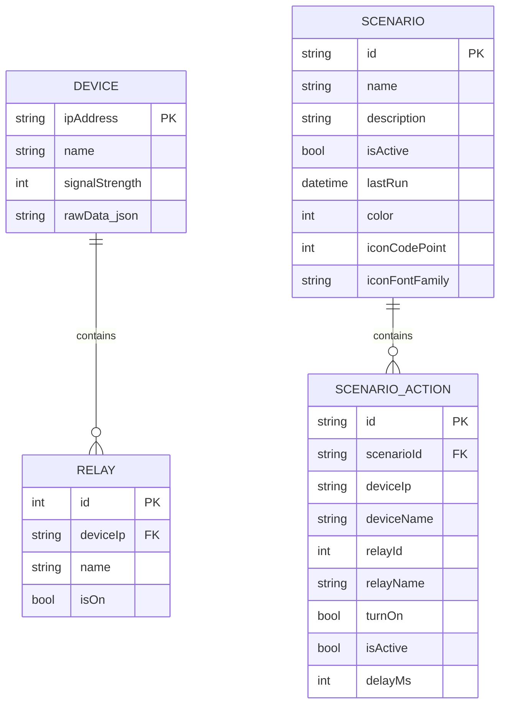
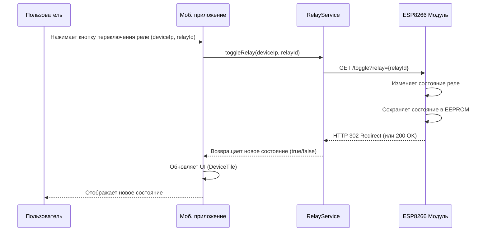
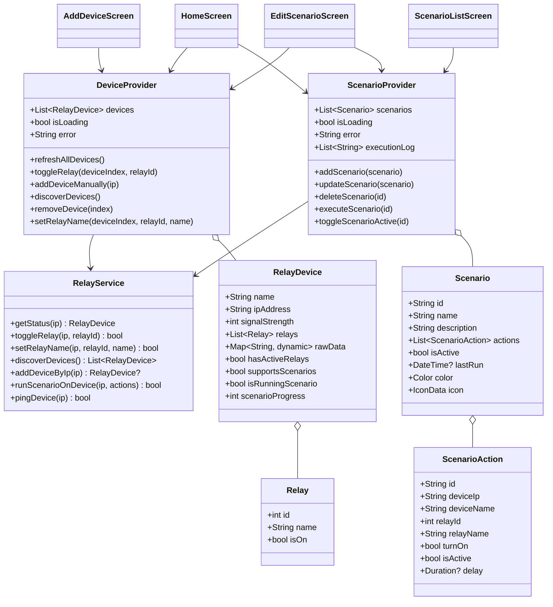
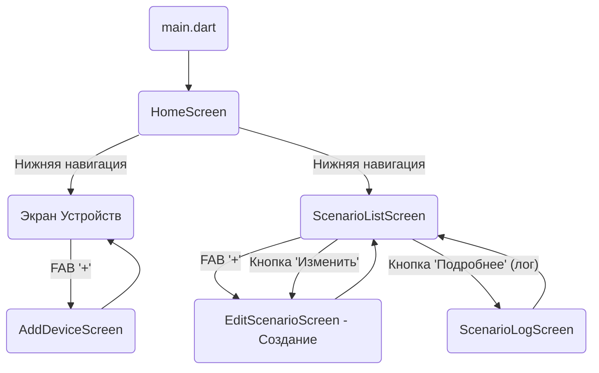

**(Титульный лист оформляется по образцу Приложения А методических рекомендаций)**

---

## Содержание

[Введение](#введение)
[1 Анализ предметной области и описание технологии проектирования ИС](#1-анализ-предметной-области-и-описание-технологии-проектирования-ис)
&nbsp;&nbsp;&nbsp;&nbsp;[1.1 Описание предметной области](#11-описание-предметной-области)
&nbsp;&nbsp;&nbsp;&nbsp;[1.2 Определение целевых групп пользователей](#12-определение-целевых-групп-пользователей)
&nbsp;&nbsp;&nbsp;&nbsp;[1.3 Определение ограничений проектного решения](#13-определение-ограничений-проектного-решения)
&nbsp;&nbsp;&nbsp;&nbsp;[1.4 Организационная диаграмма управления](#14-организационная-диаграмма-управления)
&nbsp;&nbsp;&nbsp;&nbsp;[1.5 Анализ существующих решений](#15-анализ-существующих-решений)
&nbsp;&nbsp;&nbsp;&nbsp;[1.6 Выбор средств реализации](#16-выбор-средств-реализации)
[2 Техническое задание на разработку](#2-техническое-задание-на-разработку)
&nbsp;&nbsp;&nbsp;&nbsp;[2.1 Определение требований к функциональности приложения](#21-определение-требований-к-функциональности-приложения)
&nbsp;&nbsp;&nbsp;&nbsp;[2.2 Определение требований к интерфейсу](#22-определение-требований-к-интерфейсу)
&nbsp;&nbsp;&nbsp;&nbsp;&nbsp;&nbsp;&nbsp;&nbsp;[2.2.1 Определение требований к дизайну](#221-определение-требований-к-дизайну)
&nbsp;&nbsp;&nbsp;&nbsp;&nbsp;&nbsp;&nbsp;&nbsp;[2.2.2 Определение требований к эргономике](#222-определение-требований-к-эргономике)
&nbsp;&nbsp;&nbsp;&nbsp;[2.3 Определение требований к надежности системы](#23-определение-требований-к-надежности-системы)
[3 Описание этапов разработки ИС](#3-описание-этапов-разработки-ис)
&nbsp;&nbsp;&nbsp;&nbsp;[3.1 Описание исходных данных](#31-описание-исходных-данных)
&nbsp;&nbsp;&nbsp;&nbsp;[3.2 Проектирование и дизайн системы](#32-проектирование-и-дизайн-системы)
&nbsp;&nbsp;&nbsp;&nbsp;&nbsp;&nbsp;&nbsp;&nbsp;[3.2.1 Функциональная модель в нотации IDEF0](#321-функциональная-модель-в-нотации-idef0)
&nbsp;&nbsp;&nbsp;&nbsp;&nbsp;&nbsp;&nbsp;&nbsp;[3.2.2 Модель бизнес-процессов в нотации IDEF3](#322-модель-бизнес-процессов-в-нотации-idef3)
&nbsp;&nbsp;&nbsp;&nbsp;&nbsp;&nbsp;&nbsp;&nbsp;[3.2.3 Схема процессов BPMN](#323-схема-процессов-bpmn)
&nbsp;&nbsp;&nbsp;&nbsp;&nbsp;&nbsp;&nbsp;&nbsp;[3.2.4 Диаграмма потоков данных DFD](#324-диаграмма-потоков-данных-dfd)
&nbsp;&nbsp;&nbsp;&nbsp;&nbsp;&nbsp;&nbsp;&nbsp;[3.2.5 Диаграмма «сущность-связь» (ERD)](#325-диаграмма-сущность-связь-erd)
&nbsp;&nbsp;&nbsp;&nbsp;&nbsp;&nbsp;&nbsp;&nbsp;[3.2.6 Диаграммы системы в нотации UML](#326-диаграммы-системы-в-нотации-uml)
&nbsp;&nbsp;&nbsp;&nbsp;[3.3 Моделирование и реинжиниринг бизнес-процессов](#33-моделирование-и-реинжиниринг-бизнес-процессов)
&nbsp;&nbsp;&nbsp;&nbsp;&nbsp;&nbsp;&nbsp;&nbsp;[3.3.1 Моделирование процессов «AS-IS»](#331-моделирование-процессов-as-is)
&nbsp;&nbsp;&nbsp;&nbsp;&nbsp;&nbsp;&nbsp;&nbsp;[3.3.2 Моделирование процессов «TO-BE»](#332-моделирование-процессов-to-be)
&nbsp;&nbsp;&nbsp;&nbsp;[3.4 Описание схемы физической модели базы данных](#34-описание-схемы-физической-модели-базы-данных)
&nbsp;&nbsp;&nbsp;&nbsp;[3.5 Описание структуры приложения](#35-описание-структуры-приложения)
&nbsp;&nbsp;&nbsp;&nbsp;[3.6 Разработка макетов форм (страниц), описание дизайна приложения](#36-разработка-макетов-форм-страниц-описание-дизайна-приложения)
&nbsp;&nbsp;&nbsp;&nbsp;[3.7 Анализ и описание технологии разработки](#37-анализ-и-описание-технологии-разработки)
&nbsp;&nbsp;&nbsp;&nbsp;[3.8 Описание этапов тестирования программного решения](#38-описание-этапов-тестирования-программного-решения)
[4 Руководство пользователя](#4-руководство-пользователя)
[5 Руководство администратора](#5-руководство-администратора)
[Заключение](#заключение)
[Список используемых источников](#список-используемых-источников)
[Приложение А. Листинг программы](#приложение-а-листинг-программы)
[Приложение Б. Результаты тестирования (TEST-CASE)](#приложение-б-результаты-тестирования-test-case)

---

## Введение

### Обоснование актуальности темы

Системы "умного дома" набирают все большую популярность благодаря удобству, повышению комфорта, безопасности и энергоэффективности жилища. Разработка доступных и гибких решений для автоматизации домашних устройств является актуальной задачей, отвечающей современным тенденциям развития Интернета вещей (IoT). Создание системы, позволяющей удаленно управлять электроприборами и настраивать сценарии их работы, представляет значительный практический интерес.

### Объект и предмет исследования

*   **Объект исследования:** Процесс автоматизации управления бытовыми электроприборами в жилом помещении.
*   **Предмет исследования:** Проектирование и разработка информационной системы "Умный дом", включающей аппаратный модуль на базе ESP8266 и мобильное приложение на Flutter, для управления реле и выполнения сценариев автоматизации в локальной сети.

### Цель работы

Целью данной курсовой работы является проектирование и разработка прототипа автоматизированной системы управления умным домом, включающей аппаратный модуль на базе микроконтроллера ESP8266 для управления реле и кроссплатформенное мобильное приложение для взаимодействия с пользователем.

### Задачи работы

Для достижения поставленной цели необходимо решить следующие задачи:

1.  Проанализировать предметную область автоматизации жилых помещений и существующие технологии.
2.  Разработать техническое задание, определяющее требования к системе.
3.  Спроектировать архитектуру системы, определить ее основные компоненты и протокол взаимодействия.
4.  Выбрать подходящие технологии и инструментальные средства для разработки.
5.  Разработать прошивку для микроконтроллера ESP8266.
6.  Разработать кроссплатформенное мобильное приложение.
7.  Разработать пользовательскую и административную документацию.
8.  Провести тестирование разработанной системы и оформить результаты.

### Ссылка на проект в системе контроля версий

*(Здесь необходимо указать ссылку на ваш репозиторий, например, на GitHub)*
Ссылка: [https://github.com/ваш_логин/ваш_репозиторий](https://github.com/ваш_логин/ваш_репозиторий)

---

## 1 Анализ предметной области и описание технологии проектирования ИС

### 1.1 Описание предметной области

Предметной областью данной работы является автоматизация управления электроприборами в рамках концепции "Умного дома". "Умный дом" — это комплекс систем автоматизации и высокотехнологичных устройств в жилом доме или квартире, объединенных в единую сеть для повышения комфорта, безопасности, энергоэффективности и удобства проживания. Основные функции включают управление освещением, климатом, бытовой техникой, системами безопасности и мультимедиа.

В контексте данной работы основное внимание уделяется управлению питанием электроприборов (например, освещение, розетки) с помощью реле, объединенных в сеть и управляемых централизованно через мобильное приложение. Система позволяет не только включать/выключать приборы, но и создавать сценарии их совместной работы.

Существует множество технологий для реализации систем "умного дома", включая проводные (KNX, Modbus) и беспроводные (Wi-Fi, Zigbee, Z-Wave, Bluetooth) протоколы. В данной работе используется Wi-Fi как основной протокол связи благодаря его широкому распространению, простоте интеграции и доступности микроконтроллеров с его поддержкой (ESP8266). Система функционирует в рамках локальной сети пользователя.

### 1.2 Определение целевых групп пользователей

Целевыми группами пользователей разрабатываемой системы являются:

*   **Домовладельцы и жильцы квартир:** Люди, желающие повысить комфорт и удобство управления электроприборами в своем жилище.
*   **Энтузиасты DIY ("Сделай сам") и технологий:** Пользователи, интересующиеся созданием собственных систем умного дома и имеющие базовые технические навыки для сборки и настройки аппаратной части.
*   **Студенты и разработчики:** Изучающие технологии Интернета вещей, разработку под ESP8266 и мобильную разработку на Flutter.

### 1.3 Определение ограничений проектного решения

*   **Локальная сеть:** Система предназначена для работы исключительно в рамках локальной Wi-Fi сети. Удаленное управление через Интернет не предусмотрено в базовой версии.
*   **Аппаратная платформа:** Система ориентирована на использование микроконтроллера ESP8266 и стандартных релейных модулей.
*   **Количество реле:** Текущая реализация аппаратного модуля рассчитана на управление 4 реле.
*   **Тип нагрузки:** Система предназначена для коммутации стандартной бытовой нагрузки (освещение, розетки) через реле. Управление диммируемыми устройствами или устройствами с другими интерфейсами не поддерживается.
*   **Безопасность:** В текущей версии отсутствует шифрование данных и аутентификация при доступе к API ESP8266, что является ограничением при развертывании в незащищенных сетях.
*   **Масштабируемость сценариев:** Количество действий в одном сценарии на ESP8266 ограничено (в прошивке - 10 действий).

### 1.4 Организационная диаграмма управления

В контексте данной системы, предназначенной для личного использования, традиционная организационная диаграмма управления предприятием неприменима. Пользователь системы одновременно является и ее администратором. Взаимодействие происходит по схеме "Пользователь <-> Мобильное приложение <-> Управляющий модуль ESP8266".

*(Можно вставить простую диаграмму, иллюстрирующую взаимодействие пользователя с системой, если требуется)*

### 1.5 Анализ существующих решений

На рынке представлено множество готовых решений для умного дома:

*   **Умные розетки/лампы/выключатели:** Устройства от TP-Link Kasa, Xiaomi Mi Home, Яндекс, Sber и др. Обычно управляются через собственные мобильные приложения и облачные сервисы.
    *   *Преимущества:* Простота установки и использования.
    *   *Недостатки:* Зависимость от облака производителя, ограниченная функциональность, сложности с интеграцией устройств разных брендов, стоимость.
*   **DIY Платформы:** Home Assistant, OpenHAB, Domoticz. Мощные, гибкие системы с открытым исходным кодом, поддерживающие множество протоколов и устройств.
    *   *Преимущества:* Высокая гибкость, кастомизация, поддержка большого количества устройств, локальное управление.
    *   *Недостатки:* Требуют выделенного сервера (часто Raspberry Pi), сложнее в настройке для неподготовленного пользователя.
*   **Коммерческие системы:** Системы на базе KNX, Z-Wave. Профессиональные, надежные решения.
    *   *Преимущества:* Высокая надежность, масштабируемость.
    *   *Недостатки:* Высокая стоимость оборудования и установки, требуют профессионального монтажа.

Разрабатываемая система занимает нишу между простыми умными розетками и сложными DIY-платформами. Она предлагает большую гибкость, чем отдельные устройства (за счет сценариев и локального управления), но проще в настройке и дешевле, чем полнофункциональные DIY-системы или профессиональные решения, при этом предоставляя возможность самостоятельной сборки и изучения. Основным отличием является ориентация на связку ESP8266 + Flutter и работа в локальной сети без облачной зависимости.

### 1.6 Выбор средств реализации

*   **Аппаратный модуль:**
    *   **Микроконтроллер:** ESP8266 (NodeMCU) - выбран из-за низкой стоимости, наличия Wi-Fi, большого сообщества и доступности библиотек Arduino.
    *   **Среда разработки:** Arduino IDE - простая и популярная среда для разработки под ESP8266.
    *   **Язык:** C++ (в рамках Arduino).
    *   **Библиотеки:**
        *   `ESP8266WiFi`, `ESP8266WebServer`: Базовые для сетевого взаимодействия.
        *   `WiFiManager`: Для упрощения настройки Wi-Fi.
        *   `ArduinoJson`: Для работы с JSON (API и сценарии).
        *   `U8g2lib`: Для работы с OLED-дисплеем.
        *   `EEPROM`: Для энергонезависимого хранения данных.
        *   `ESP8266mDNS`: Для обнаружения устройств.
*   **Мобильное приложение:**
    *   **Фреймворк:** Flutter - выбран для кроссплатформенной разработки (Android/iOS) из единой кодовой базы, что ускоряет разработку. Обладает высокой производительностью и гибким UI.
    *   **Язык программирования:** Dart - современный объектно-ориентированный язык, оптимизированный для разработки UI.
    *   **Управление состоянием:** Provider - популярное и рекомендованное решение для управления состоянием во Flutter, обеспечивает разделение логики и UI.
    *   **HTTP-клиент:** Пакет `http` - стандартный пакет для выполнения HTTP-запросов.
    *   **Локальное хранение:** Пакет `shared_preferences` - простое решение для хранения небольших объемов данных (настройки, списки устройств/сценариев).
    *   **Обнаружение устройств:** Пакет `multicast_dns` и кастомная логика сканирования IP - для поиска устройств в сети.
*   **Протокол взаимодействия:** HTTP + JSON - широко распространенный, простой и понятный формат для обмена данными между устройствами в сети.

---

## 2 Техническое задание на разработку

*(Этот раздел формируется на основе реализованных функций и требований методички. В реальном проекте ТЗ разрабатывается до начала кодирования.)*

### 2.1 Определение требований к функциональности приложения

1.  **Управление устройствами:**
    *   Автоматическое обнаружение управляющих модулей ESP8266 в локальной сети (по mDNS и сканированию IP).
    *   Возможность ручного добавления устройства по IP-адресу с предварительной проверкой доступности.
    *   Отображение списка добавленных устройств с указанием имени, IP-адреса, статуса соединения (косвенно через RSSI) и количества активных реле.
    *   Возможность обновления статуса всех устройств или отдельного устройства.
    *   Возможность удаления устройства из списка.
    *   Сохранение списка добавленных устройств между запусками приложения.
2.  **Управление реле:**
    *   Отображение списка реле для каждого устройства с указанием пользовательского имени и текущего состояния (ВКЛ/ВЫКЛ).
    *   Возможность переключения состояния каждого реле.
    *   Возможность задания пользовательского имени для каждого реле.
3.  **Управление сценариями:**
    *   Возможность создания новых сценариев автоматизации.
    *   Возможность редактирования существующих сценариев (изменение имени, описания, цвета, иконки, списка действий).
    *   Возможность удаления сценариев.
    *   Возможность активации/деактивации сценариев.
    *   Возможность добавления/редактирования/удаления действий в сценарии. Каждое действие должно включать: выбор устройства, выбор реле, выбор состояния (ВКЛ/ВЫКЛ), установка задержки перед выполнением (0-60 секунд).
    *   Возможность запуска выбранного активного сценария.
    *   Отображение лога выполнения последнего запущенного сценария.
    *   Сохранение созданных сценариев между запусками приложения.
4.  **Общие требования:**
    *   Приложение должно работать в рамках локальной Wi-Fi сети.
    *   Интерфейс должен быть интуитивно понятным.
    *   Должна быть обеспечена обратная связь с пользователем (индикаторы загрузки, сообщения об ошибках и успехах).
    *   Приложение должно быть кроссплатформенным (Android, iOS).
    *   *(Опционально, если реализовано)* Поддержка многопользовательского режима в рамках одной локальной сети (несколько экземпляров приложения могут управлять одними и теми же устройствами, но без синхронизации состояния между приложениями).

### 2.2 Определение требований к интерфейсу

#### 2.2.1 Определение требований к дизайну

1.  **Стиль:** Использовать гайдлайны Material Design 3.
2.  **Цветовая схема:** Использовать определенную цветовую схему (основной: `0xFF2C3E50`, вторичный: `0xFF3498DB`, акцентный: `0xFF1ABC9C`, фон: `0xFFF5F7FA`). Цвета должны быть консистентны во всем приложении. Для сценариев предусмотреть возможность выбора цвета пользователем из палитры.
3.  **Типографика:** Использовать читаемый шрифт (Roboto) с различными размерами и начертаниями для заголовков, основного текста и подписей.
4.  **Иконки:** Использовать стандартные иконки Material Icons для обозначения действий и состояний. Для сценариев предусмотреть возможность выбора иконки пользователем.
5.  **Компоновка:** Использовать карточки (`Card`) для визуального разделения информации об устройствах и сценариях. Обеспечить достаточные отступы и выравнивание элементов.
6.  **Обратная связь:** Использовать визуальные элементы для обратной связи: индикаторы загрузки (`SpinKit`), изменение цвета/иконок для отображения состояния, всплывающие сообщения (`SnackBar`).

#### 2.2.2 Определение требований к эргономике

1.  **Навигация:** Реализовать простую и понятную навигацию с использованием `BottomNavigationBar` для переключения между основными разделами (Устройства, Сценарии). Использовать `AppBar` с заголовками и кнопками действий.
2.  **Управление:** Элементы управления (кнопки, переключатели) должны быть достаточно крупными и легко нажимаемыми. Основные действия (добавление, запуск) должны быть легко доступны (`FloatingActionButton`, основные кнопки).
3.  **Представление информации:** Информация о состоянии устройств и реле должна быть представлена наглядно (цветовые индикаторы, текстовые статусы). Уровень сигнала Wi-Fi должен отображаться в понятном виде (например, "Отличный", "Хороший", "Слабый").
4.  **Обработка ошибок:** При возникновении ошибок (сетевых, логических) выводить пользователю понятные сообщения с возможными причинами и предложениями по устранению.
5.  **Производительность:** Интерфейс должен быть отзывчивым, без зависаний во время выполнения фоновых задач (сетевые запросы, обработка данных).

### 2.3 Определение требований к надежности системы

1.  **Обработка ошибок соединения:** Приложение и прошивка должны корректно обрабатывать ошибки сети (недоступность устройства, таймауты запросов) и информировать пользователя.
2.  **Сохранение состояния:** Состояние реле и их имена должны сохраняться в EEPROM ESP8266 при перезагрузке. Список устройств и сценарии должны сохраняться в `SharedPreferences` мобильного приложения.
3.  **Валидация данных:** Обеспечить базовую валидацию вводимых пользователем данных (например, формат IP-адреса, обязательное имя сценария).
4.  **Стабильность прошивки:** Прошивка ESP8266 должна быть стабильной и не приводить к зависаниям или непредсказуемому поведению.
5.  **Корректное выполнение сценариев:** Механизм выполнения сценариев на ESP8266 должен надежно отрабатывать последовательность действий и задержки.

---

## 3 Описание этапов разработки ИС

### 3.1 Описание исходных данных

Исходными данными для системы являются:

*   **Данные конфигурации сети:** SSID и пароль локальной Wi-Fi сети (вводятся пользователем через интерфейс WiFiManager при первой настройке ESP8266).
*   **Данные устройств:** IP-адреса устройств (определяются автоматически или вводятся вручную), имена реле (по умолчанию или заданные пользователем).
*   **Данные сценариев:** Имя, описание, цвет, иконка сценария, список действий (устройство, реле, состояние, задержка) - вводятся пользователем в мобильном приложении.
*   **Состояние системы:** Текущее состояние реле (ВКЛ/ВЫКЛ), уровень сигнала Wi-Fi (RSSI) - получаются от модуля ESP8266.

### 3.2 Проектирование и дизайн системы

Для визуализации структуры и процессов системы используются различные диаграммы и нотации.

#### 3.2.1 Функциональная модель в нотации IDEF0

Нотация IDEF0 используется для описания функций системы и потоков данных/управления между ними. Для данной системы можно выделить следующие основные функции верхнего уровня:

*   A0: Управление системой "Умный дом"
    *   Входы: Команды пользователя (через приложение), Данные Wi-Fi сети.
    *   Управление: Настройки системы, Алгоритмы работы.
    *   Выходы: Статус устройств/реле, Визуальная информация (дисплей), Управляющие сигналы на реле.
    *   Механизмы: Мобильное приложение, Модуль ESP8266, Пользователь.

*(Здесь следует вставить диаграмму IDEF0 A0 и, возможно, декомпозицию A1-A4, например: A1-Управление устройствами, A2-Управление сценариями, A3-Взаимодействие с оборудованием, A4-Отображение информации. Однако, для систем такого типа IDEF0 может быть избыточной, и лучше сосредоточиться на UML и BPMN.)*

#### 3.2.2 Модель бизнес-процессов в нотации IDEF3

Нотация IDEF3 используется для описания сценариев выполнения процессов. Она может быть полезна для детализации сложных сценариев взаимодействия, но в данном проекте для описания потоков работ более наглядной является нотация BPMN.

*(Здесь можно кратко описать назначение IDEF3 и указать, что для данной работы выбрана нотация BPMN для моделирования процессов.)*

#### 3.2.3 Схема процессов BPMN

Нотация BPMN (Business Process Model and Notation) используется для моделирования бизнес-процессов.

**Пример 1: Процесс добавления устройства вручную**
```mermaid
graph TD
    A[Пользователь открывает экран добавления] --> B{Вводит IP-адрес};
    B --> C[Нажимает "Проверить соединение"];
    C --> D{Приложение отправляет /ping};
    D --> E{ESP8266 отвечает?};
    E -- Да --> F{Приложение отправляет /status};
    F --> G{ESP8266 отвечает корректно?};
    G -- Да --> H[Приложение отображает "Успешно"];
    H --> I[Пользователь нажимает "Добавить"];
    I --> J{Приложение сохраняет IP};
    J --> K[Устройство добавлено];
    E -- Нет --> L[Приложение отображает "Недоступно"];
    G -- Нет --> M[Приложение отображает "Ошибка данных"];
    L --> Z(Конец);
    M --> Z;
    K --> Z;
```
*(Здесь следует вставить диаграмму BPMN для процесса добавления устройства)*

**Пример 2: Процесс выполнения сценария**
```mermaid
graph TD
    A[Пользователь нажимает "Запустить сценарий"] --> B{Приложение отправляет /run-scenario с действиями};
    B --> C{ESP8266 получает запрос};
    C --> D{Парсит JSON};
    D -- Успешно --> E{Начинает выполнение действий};
    E --> F[Цикл по действиям];
    F -- Есть следующее действие --> G{Ждет задержку (delayMs)};
    G --> H{Переключает реле (relayId, turnOn)};
    H --> I{Обновляет статус/дисплей};
    I --> F;
    F -- Действия кончились --> J[Сценарий завершен];
    J --> K{ESP8266 отвечает приложению (успех)};
    D -- Ошибка --> L{ESP8266 отвечает приложению (ошибка)};
    K --> M[Приложение отображает результат];
    L --> M;
```
*(Здесь следует вставить диаграмму BPMN для процесса выполнения сценария)*

#### 3.2.4 Диаграмма потоков данных DFD

Диаграмма DFD (Data Flow Diagram) показывает потоки данных между процессами, хранилищами данных и внешними сущностями.

**Контекстная диаграмма (Уровень 0):**
```mermaid
graph TD
    subgraph Система "Умный дом"
        P0(0. Управление домом)
    end
    U[Пользователь] -- Команды управления/Настройки --> P0;
    P0 -- Статус системы/Логи --> U;
    HW[Оборудование (Реле, Дисплей)] <-- Управляющие сигналы --- P0;
    P0 <-- Данные состояния --- HW;
```
*(Здесь следует вставить контекстную диаграмму DFD)*

**Декомпозиция (Уровень 1):**
```mermaid
graph TD
    U[Пользователь] -- Команды упр. устройствами --> P1(1. Управление устройствами);
    U -- Команды упр. сценариями --> P2(2. Управление сценариями);
    P1 -- Статус устройств --> U;
    P2 -- Статус сценариев/Логи --> U;
    P1 -- Запрос статуса/Команда реле --> P3(3. Взаимодействие с ESP);
    P2 -- Запрос запуска сценария --> P3;
    P3 -- Статус устройства/Результат --> P1;
    P3 -- Результат выполнения --> P2;
    P3 -- Управляющий сигнал --> HW[Оборудование];
    HW -- Данные состояния --> P3;
    P1 -- Данные устройств --> D1[Хранилище устройств];
    D1 -- Данные устройств --> P1;
    P2 -- Данные сценариев --> D2[Хранилище сценариев];
    D2 -- Данные сценариев --> P2;
    P3 -- Данные ESP --> D3[Хранилище ESP (EEPROM)];
    D3 -- Данные ESP --> P3;

```
*(Здесь следует вставить диаграмму DFD Уровня 1)*

#### 3.2.5 Диаграмма «сущность-связь» (ERD)

ERD (Entity-Relationship Diagram) моделирует структуру данных. Хотя система не использует реляционную БД, можно представить логические сущности и их связи.


*(Здесь следует вставить ER-диаграмму)*

#### 3.2.6 Диаграммы системы в нотации UML

**Диаграмма вариантов использования (Use Case Diagram):**
```mermaid
graph TD
    subgraph Система "Умный дом"
        UC1(Управлять устройствами)
        UC2(Управлять реле)
        UC3(Настраивать имена реле)
        UC4(Создавать сценарии)
        UC5(Редактировать сценарии)
        UC6(Запускать сценарии)
        UC7(Просматривать лог сценария)
        UC8(Добавлять/Удалять устройства)
        UC9(Активировать/Деактивировать сценарии)
    end
    User[Пользователь] --> UC1
    User --> UC2
    User --> UC3
    User --> UC4
    User --> UC5
    User --> UC6
    User --> UC7
    User --> UC8
    User --> UC9
    UC1 ..> UC8 : include
    UC1 ..> UC2 : include
    UC2 ..> UC3 : include
    UC4 ..> UC5 : extends
    UC6 ..> UC7 : include
```
*(Здесь следует вставить диаграмму Use Case)*

**Диаграмма последовательности (Sequence Diagram) - Пример "Переключить реле":**

*(Здесь следует вставить диаграмму Sequence для переключения реле и, возможно, для запуска сценария)*

**Диаграмма классов (Class Diagram) - Упрощенная:**

*(Здесь следует вставить диаграмму классов)*

### 3.3 Моделирование и реинжиниринг бизнес-процессов

#### 3.3.1 Моделирование процессов «AS-IS»

До внедрения системы процесс управления электроприборами выглядел следующим образом:

*   **Включение/выключение:** Пользователь физически подходит к выключателю или прибору и вручную изменяет его состояние.
*   **Сценарии:** Отсутствуют. Для выполнения последовательности действий (например, выключить свет в коридоре и включить ночник в спальне) пользователь должен выполнить каждое действие вручную последовательно.
*   **Удаленное управление:** Отсутствует. Пользователь должен находиться непосредственно у прибора или выключателя.
*   **Мониторинг:** Отсутствует возможность узнать текущее состояние прибора удаленно.

#### 3.3.2 Моделирование процессов «TO-BE»

После внедрения разработанной системы процесс управления изменяется:

*   **Включение/выключение:** Пользователь открывает мобильное приложение, выбирает нужное устройство и реле, нажимает кнопку для изменения состояния. Команда передается по Wi-Fi на модуль ESP8266, который физически переключает реле.
*   **Сценарии:** Пользователь заранее создает сценарий в мобильном приложении, определяя последовательность включения/выключения различных реле с возможными задержками. Для запуска сценария пользователь нажимает одну кнопку в приложении. Команда на выполнение сценария передается на соответствующие модули ESP8266, которые выполняют действия локально.
*   **Удаленное управление:** Пользователь может управлять приборами из любой точки в пределах действия локальной Wi-Fi сети.
*   **Мониторинг:** Мобильное приложение отображает актуальное состояние всех подключенных реле и статус выполнения сценариев. OLED-дисплей на модуле ESP8266 также показывает локальный статус.

Модели BPMN, представленные в п. 3.2.3, иллюстрируют ключевые процессы «TO-BE».

### 3.4 Описание схемы физической модели базы данных

Система не использует традиционную реляционную базу данных. Хранение данных реализовано следующим образом:

*   **Модуль ESP8266:**
    *   Используется **EEPROM** (энергонезависимая память микроконтроллера).
    *   **Структура хранения:**
        *   Область для имен реле: Последовательно хранятся строки (сначала байт длины, затем символы, завершающий 0). Каждому имени выделяется фиксированный размер (`NAME_MAX_LENGTH`). Адрес начала: `RELAY_NAMES_START_ADDRESS`.
        *   Область для состояний реле: Последовательно хранятся байты (0 или 1), представляющие состояние каждого реле. Адрес начала: `RELAY_STATES_START_ADDRESS`.
*   **Мобильное приложение (Flutter):**
    *   Используется **SharedPreferences** (хранилище ключ-значение на устройстве).
    *   **Структура хранения:**
        *   Ключ `'device_ips'`: Хранит список (`List<String>`) IP-адресов добавленных устройств.
        *   Ключ `'scenarios'`: Хранит список (`List<String>`) сценариев, где каждый сценарий сериализован в строку JSON.

Эта схема обеспечивает персистентность необходимых данных без развертывания полноценной СУБД.

### 3.5 Описание структуры приложения

Мобильное приложение Flutter имеет следующую структуру (основные директории и файлы):

*   `lib/`: Корневая директория исходного кода.
    *   `main.dart`: Точка входа, инициализация приложения, настройка `MultiProvider`, определение темы `MaterialApp`, запуск `HomeScreen`.
    *   `models/`: Определения классов моделей данных.
        *   `relay_device.dart`: Классы `RelayDevice` и `Relay`.
        *   `scenario.dart`: Классы `Scenario` и `ScenarioAction`.
    *   `providers/`: Классы управления состоянием.
        *   `device_provider.dart`: `DeviceProvider` (управление устройствами).
        *   `scenario_provider.dart`: `ScenarioProvider` (управление сценариями).
    *   `screens/`: Виджеты, представляющие экраны приложения.
        *   `home_screen.dart`: Главный экран с навигацией.
        *   `add_device_screen.dart`: Экран добавления устройства.
        *   `edit_scenario_screen.dart`: Экран создания/редактирования сценария.
        *   `scenario_list_screen.dart`: Экран списка сценариев.
        *   `scenario_log_screen.dart`: Экран лога выполнения сценария.
    *   `services/`: Классы для взаимодействия с внешними системами/API.
        *   `relay_service.dart`: `RelayService` (HTTP-взаимодействие с ESP8266).
    *   `widgets/`: Переиспользуемые компоненты UI.
        *   `device_tile.dart`: Карточка для отображения устройства.
        *   `scenario_tile.dart`: Карточка для отображения сценария.
        *   `scenario_action_card.dart`: Карточка для отображения действия в сценарии.

**Навигационная схема:**


*(Здесь следует вставить диаграмму навигации)*

### 3.6 Разработка макетов форм (страниц), описание дизайна приложения

Дизайн приложения соответствует гайдлайнам Material Design 3. Используется единая цветовая схема и типографика, определенные в `main.dart`.

*   **Основные экраны (`HomeScreen`, `ScenarioListScreen`):** Используют `Scaffold` с `AppBar` и `BottomNavigationBar`/`FloatingActionButton`. Списки устройств/сценариев отображаются с помощью `ListView.builder` и кастомных виджетов-карточек (`DeviceTile`, `ScenarioTile`). Предусмотрены состояния загрузки и отображения ошибок/пустых списков.
*   **Экран добавления устройства (`AddDeviceScreen`):** Использует `Card` для разделения секций ручного и автоматического добавления. Применяются `TextFormField` с валидацией для ввода IP, `ElevatedButton` и `OutlinedButton` для действий, `SpinKit` для индикации поиска.
*   **Экран редактирования сценария (`EditScenarioScreen`):** Использует `Form` для ввода названия/описания. Применяются `Card` для группировки полей. Выбор цвета/иконки реализован через диалоговые окна (`showDialog`) с кастомным отображением опций. Список действий отображается с помощью `ListView` и `ScenarioActionCard`. Диалог добавления/редактирования действия использует `DropdownButtonFormField`, `SegmentedButton`, `Slider`.
*   **Карточки (`DeviceTile`, `ScenarioTile`, `ScenarioActionCard`):** Используют `Card` с `ClipRRect` и цветной боковой границей для визуального акцента. Информация структурирована с помощью `Row`, `Column`, `Divider`. Активно используются `Icon` и `Text` с различными стилями для наглядности.

*(Здесь следует вставить макеты или скриншоты основных экранов приложения)*

### 3.7 Анализ и описание технологии разработки

*   **Прошивка ESP8266:**
    *   **Язык:** C++ (Arduino).
    *   **Среда:** Arduino IDE.
    *   **Ключевые библиотеки:**
        *   `ESP8266WiFi`, `ESP8266WebServer`: Основа для сетевого взаимодействия по HTTP.
        *   `WiFiManager`: Упрощает подключение к Wi-Fi, избавляя от необходимости жестко кодировать SSID/пароль.
        *   `ArduinoJson`: Эффективная библиотека для парсинга и генерации JSON, необходимая для API и обработки сценариев.
        *   `U8g2lib`: Мощная библиотека для работы с различными монохромными дисплеями, включая поддержку шрифтов (в т.ч. кириллицы).
        *   `EEPROM`: Стандартная библиотека для работы с энергонезависимой памятью ESP8266.
        *   `ESP8266mDNS`: Реализует протокол mDNS для обнаружения устройств по имени в локальной сети.
    *   **Подход:** Событийно-ориентированный (`loop()` обрабатывает запросы сервера, кнопку, дисплей, сценарии).
*   **Мобильное приложение:**
    *   **Фреймворк:** Flutter. Позволяет создавать нативные приложения для Android и iOS из единой кодовой базы Dart. Использует декларативный подход к построению UI.
    *   **Язык:** Dart. Объектно-ориентированный язык с null-safety, оптимизированный для UI.
    *   **Архитектура:** Приложение построено с разделением на слои: UI (экраны, виджеты), управление состоянием (провайдеры), сервисный слой (взаимодействие с сетью).
    *   **Управление состоянием:** Provider. Используется для предоставления `DeviceProvider` и `ScenarioProvider` дереву виджетов и реакции на изменения состояния.
    *   **Асинхронность:** Активно используются `async`/`await` для выполнения сетевых запросов и других длительных операций без блокировки UI.
    *   **Ключевые пакеты:**
        *   `provider`: Управление состоянием.
        *   `http`: Выполнение HTTP-запросов.
        *   `shared_preferences`: Локальное хранение данных.
        *   `multicast_dns`: Обнаружение устройств по mDNS.
        *   `flutter_spinkit`: Набор индикаторов загрузки.
        *   `uuid`: Генерация уникальных идентификаторов для сценариев/действий.
        *   `intl`: Форматирование дат (для времени последнего запуска сценария).

### 3.8 Описание этапов тестирования программного решения

Тестирование проводилось на нескольких уровнях:

1.  **Модульное тестирование (Unit Testing):** Тестирование отдельных функций и методов (например, парсинг JSON в `RelayService`, форматирование длительности в виджетах). *(В данном проекте формальные юнит-тесты могли не писаться, но этот этап подразумевается при отладке)*.
2.  **Виджетное тестирование (Widget Testing):** Тестирование отдельных виджетов Flutter для проверки корректности их отображения и реакции на взаимодействие. *(Также могло выполняться неформально)*.
3.  **Интеграционное тестирование:** Проверка взаимодействия между компонентами приложения (например, экран -> провайдер -> сервис) и взаимодействия приложения с прошивкой ESP8266.
4.  **Функциональное тестирование (Ручное):** Проверка выполнения всех пользовательских сценариев и функций системы в соответствии с требованиями. Этот этап включал проверку всех кнопок, форм, переходов между экранами, корректность отображения данных, обработку ошибок.

Результаты функционального тестирования оформляются в виде тест-кейсов (Test Cases). Примеры приведены в Приложении Б.

---

## 4 Руководство пользователя

*(Согласно ГОСТ 34 и ГОСТ 19. Это краткое описание основных действий)*

### 4.1 Назначение и условия применения

Данное руководство предназначено для пользователей системы управления умным домом. Система позволяет управлять подключенными к модулям ESP8266 реле и запускать сценарии автоматизации через мобильное приложение Flutter в рамках локальной Wi-Fi сети.

Для работы системы необходимо:
*   Собранный и прошитый модуль(и) ESP8266 с реле и дисплеем.
*   Наличие Wi-Fi сети с доступом к ней для модулей ESP8266.
*   Смартфон или планшет (Android/iOS) с установленным мобильным приложением, подключенный к той же Wi-Fi сети.

### 4.2 Подготовка к работе

1.  **Первый запуск модуля ESP8266:** При первом включении модуль создаст Wi-Fi точку доступа с именем "SmartRelay". Подключитесь к этой точке доступа с помощью смартфона или компьютера. Откроется страница конфигурации Wi-Fi. Выберите вашу домашнюю Wi-Fi сеть, введите пароль и нажмите "Save". Модуль перезагрузится и подключится к вашей сети. На OLED-дисплее отобразится IP-адрес.
2.  **Установка мобильного приложения:** Установите мобильное приложение на ваш смартфон/планшет.
3.  **Подключение к Wi-Fi:** Убедитесь, что ваш смартфон/планшет подключен к той же Wi-Fi сети, что и модуль(и) ESP8266.

### 4.3 Описание операций

1.  **Запуск приложения:** Запустите установленное мобильное приложение.
2.  **Обнаружение и добавление устройств:**
    *   При первом запуске или при нажатии кнопки "Поиск устройств" на пустом экране приложение попытается автоматически найти модули в сети.
    *   Если устройства не найдены, или вы знаете IP-адрес модуля (отображается на дисплее ESP), перейдите на экран добавления устройств (кнопка "+" на вкладке "Устройства").
    *   Введите IP-адрес и нажмите "Проверить соединение". При успехе нажмите "Добавить устройство".
3.  **Управление устройствами (вкладка "Устройства"):**
    *   На экране отображается список добавленных устройств.
    *   Для каждого устройства виден его статус и список реле.
    *   Нажмите кнопку "Включить"/"Выключить" рядом с реле для изменения его состояния.
    *   Нажмите иконку карандаша рядом с именем реле, чтобы задать ему пользовательское имя.
    *   Используйте меню (...) на карточке устройства для обновления его статуса или удаления из приложения.
4.  **Управление сценариями (вкладка "Сценарии"):**
    *   На экране отображается список созданных сценариев.
    *   Нажмите кнопку "+" для создания нового сценария.
    *   Нажмите кнопку "Изменить" на карточке сценария для его редактирования.
    *   Нажмите кнопку "Запустить" для выполнения сценария.
    *   Используйте переключатель для активации/деактивации сценария.
    *   Нажмите иконку корзины для удаления сценария.
5.  **Создание/Редактирование сценария:**
    *   Введите имя и описание сценария.
    *   Выберите цвет и иконку.
    *   Нажмите "Добавить" в секции "Действия".
    *   В диалоге выберите устройство, реле, желаемое состояние (ВКЛ/ВЫКЛ) и установите задержку (если нужна). Нажмите "Добавить".
    *   Добавьте необходимое количество действий. Используйте кнопки на карточке действия для его редактирования, удаления или временного отключения (переключатель).
    *   Нажмите "Сохранить сценарий".
6.  **Просмотр лога выполнения:** После запуска сценария нажмите кнопку "Подробнее" во всплывающем сообщении о результате, чтобы увидеть детальный лог выполнения действий.

### 4.4 Аварийные ситуации

*   **Устройство не отвечает:** Убедитесь, что модуль ESP8266 включен и подключен к той же Wi-Fi сети, что и смартфон. Проверьте IP-адрес. Попробуйте обновить статус устройства в приложении.
*   **Ошибка выполнения сценария:** Проверьте лог выполнения для выявления проблемного действия. Убедитесь, что соответствующие устройства доступны.
*   **Не удается подключить ESP8266 к Wi-Fi:** Нажмите и удерживайте кнопку сброса на модуле ESP8266 в течение 5 секунд. Модуль перезагрузится и снова создаст точку доступа "SmartRelay" для повторной настройки.

---

## 5 Руководство администратора

*(В данной системе пользователь часто является и администратором)*

### 5.1 Общие сведения

Администратор системы отвечает за первоначальную настройку аппаратных модулей и обеспечение работы локальной сети.

### 5.2 Установка и настройка

1.  **Сборка аппаратного модуля:** Соберите модуль согласно схеме (см. Приложение А, если есть), подключив релейный модуль и OLED-дисплей к плате ESP8266.
2.  **Прошивка модуля:** Загрузите скомпилированную прошивку (`.ino.bin` файл) в ESP8266 с помощью Arduino IDE или другого подходящего инструмента (например, esptool.py).
3.  **Первоначальная настройка Wi-Fi:** Выполните шаги из п. 4.2 Руководства пользователя для подключения модуля к локальной сети через WiFiManager.
4.  **Установка мобильного приложения:** Установите приложение на устройства пользователей.

### 5.3 Обслуживание системы

*   **Обновление прошивки:** При необходимости обновите прошивку модуля ESP8266, повторно загрузив новый `.bin` файл.
*   **Сброс настроек Wi-Fi:** При смене настроек Wi-Fi сети или возникновении проблем с подключением, выполните сброс настроек модуля удержанием кнопки сброса (см. п. 4.4 Руководства пользователя).
*   **Диагностика:** При проблемах с доступностью модуля проверьте его подключение к сети, IP-адрес (на дисплее или через сканер сети), состояние питания.

### 5.4 Резервное копирование

*   **Данные ESP8266:** Имена и состояния реле хранятся в EEPROM и обычно не требуют резервного копирования для данной системы. При замене модуля потребуется заново настроить имена реле.
*   **Данные мобильного приложения:** Список устройств и сценарии хранятся локально на устройстве. Для переноса на другое устройство или резервного копирования стандартных средств не предусмотрено (требуется ручное добавление устройств и пересоздание сценариев или использование системных средств бэкапа ОС смартфона, если они захватывают данные приложений).

---

## Заключение

### Результаты работы

В результате выполнения данной курсовой работы была спроектирована и разработана автоматизированная система управления умным домом. Система состоит из аппаратного модуля на ESP8266, управляющего четырьмя реле и предоставляющего HTTP API, и кроссплатформенного мобильного приложения на Flutter для взаимодействия с пользователем.

Основные достигнутые результаты:

*   Реализовано удаленное управление реле через мобильное приложение в локальной сети.
*   Разработан механизм автоматического обнаружения и ручного добавления управляющих модулей.
*   Реализована возможность создания и выполнения пользовательских сценариев автоматизации с поддержкой задержек.
*   Обеспечено сохранение настроек (имена реле, состояния, список устройств, сценарии) между сеансами работы.
*   Аппаратный модуль предоставляет информацию о своем состоянии на встроенном OLED-дисплее.
*   Система является гибкой и масштабируемой (можно добавить больше модулей ESP8266).

### Возможные направления развития

*   **Интеграция с облачными сервисами:** Добавление возможности управления устройствами через Интернет (например, с использованием MQTT и облачного брокера).
*   **Поддержка других типов устройств:** Расширение системы для управления не только реле, но и датчиками (температуры, влажности, движения), диммерами, RGB-лентами и т.д.
*   **Голосовое управление:** Интеграция с голосовыми ассистентами (Google Assistant, Alexa).
*   **Улучшение безопасности:** Добавление аутентификации для доступа к API ESP8266.
*   **Более сложные сценарии:** Реализация сценариев, зависящих от времени, событий от датчиков или других условий.
*   **Веб-интерфейс:** Создание веб-версии приложения для управления с компьютера.
*   **Улучшение UI/UX:** Дальнейшая проработка дизайна и удобства использования мобильного приложения.

---

## Список используемых источников

*(Необходимо привести не менее 15 источников, оформленных по ГОСТ 7.32-2001 или аналогичному стандарту, используемому в вашем учебном заведении. Ниже приведены примеры и плейсхолдеры)*

1.  Федорова, Г. Н. Разработка, внедрение и адаптация программного обеспечения отраслевой направленности: учебное пособие / Г. Н. Федорова. - Москва: КУРС: ИНФРА-М, 2021. - 336 с. - (Среднее профессиональное образование). - ISBN 978-5-906818-41-6. - Текст: электронный. - URL: https://znanium.com/catalog/product/1138896 (дата обращения: 29.03.2025). - Режим доступа: по подписке.
2.  Проектирование информационных систем: учебник и практикум для среднего профессионального образования / Д. В. Чистов, П. П. Мельников, А. В. Золотарюк, Н. Б. Ничепорук; под общей редакцией Д. В. Чистова. - Москва: Издательство Юрайт, 2019. - 258 с. - (Профессиональное образование). - ISBN 978-5-534-03173-7. - Текст: электронный // ЭБС Юрайт [сайт]. - URL: https://www.biblio-online.ru/bcode/437463 (дата обращения: 29.03.2025).
3.  ГОСТ 19.701–90 (ИСО 5807-85). Схемы алгоритмов, программ данных и систем. Условные обозначения. – Введ. 1992–01–01. – М. : Изд-во стандартов, 1992. – (Единая система программной документации).
4.  ГОСТ 34.602-89 Информационная технология. Комплекс стандартов на автоматизированные системы. Техническое задание на создание автоматизированной системы. – Введ. 1990–01–01. – М. : Изд-во стандартов, 1990.
5.  Официальная документация Flutter [Электронный ресурс]. – URL: https://flutter.dev/docs (дата обращения: 29.03.2025).
6.  Официальная документация Dart [Электронный ресурс]. – URL: https://dart.dev/guides (дата обращения: 29.03.2025).
7.  Документация Arduino Core для ESP8266 [Электронный ресурс]. – URL: https://arduino-esp8266.readthedocs.io/ (дата обращения: 29.03.2025).
8.  Репозиторий библиотеки WiFiManager [Электронный ресурс]. – URL: https://github.com/tzapu/WiFiManager (дата обращения: 29.03.2025).
9.  Репозиторий библиотеки U8g2lib [Электронный ресурс]. – URL: https://github.com/olikraus/u8g2 (дата обращения: 29.03.2025).
10. Документация пакета Provider (Flutter) [Электронный ресурс]. – URL: https://pub.dev/packages/provider (дата обращения: 29.03.2025).
11. Документация пакета http (Dart) [Электронный ресурс]. – URL: https://pub.dev/packages/http (дата обращения: 29.03.2025).
12. Документация пакета shared_preferences (Flutter) [Электронный ресурс]. – URL: https://pub.dev/packages/shared_preferences (дата обращения: 29.03.2025).
13. Документация библиотеки ArduinoJson [Электронный ресурс]. – URL: https://arduinojson.org/ (дата обращения: 29.03.2025).
14. *(Добавьте еще источники)*
15. *(Добавьте еще источники)*

---

## Приложение А. Листинг программы

*(Здесь следует привести ключевые фрагменты исходного кода прошивки ESP8266 и мобильного приложения Flutter, демонстрирующие основные реализованные алгоритмы и функции. Не нужно вставлять весь код целиком.)*

### А.1 Листинг прошивки ESP8266 (esp8266_relay_controller.ino)

```cpp
// Пример: Обработчик статуса
void handleStatus() {
  recordActivity(); // Регистрируем активность
  DynamicJsonDocument doc(1024);
  doc["ip"] = WiFi.localIP().toString();
  doc["rssi"] = WiFi.RSSI();
  JsonArray relays = doc.createNestedArray("relays");
  for (int i = 0; i < NUM_RELAYS; i++) {
    JsonObject relay = relays.createNestedObject();
    relay["id"] = i;
    String safeName = relayNames[i];
    // ... (проверка имени) ...
    relay["name"] = safeName;
    relay["state"] = relayStates[i] ? "on" : "off";
  }
  doc["scenarios"] = JsonObject();
  doc["scenarios"]["supported"] = true;
  doc["scenarios"]["running"] = scenarioRunning;
  doc["scenarios"]["progress"] = scenarioRunning ?
                              (currentActionIndex * 100) / pendingActionsCount : 0;
  String jsonResponse;
  serializeJson(doc, jsonResponse);
  server.sendHeader("Access-Control-Allow-Origin", "*");
  server.sendHeader("Content-Type", "application/json; charset=utf-8");
  server.send(200, "application/json; charset=utf-8", jsonResponse);
}

// Пример: Обработчик запуска сценария
void handleRunScenario() {
  // ... (парсинг JSON из server.arg("plain")) ...
  // ... (заполнение массива pendingActions) ...
  if (pendingActionsCount > 0) {
    currentActionIndex = 0;
    scenarioRunning = true;
    nextActionTime = millis();
    Serial.print("Запуск сценария с ");
    Serial.print(pendingActionsCount);
    Serial.println(" действиями");
    server.send(200, "text/plain; charset=utf-8", "Сценарий запущен");
  } else {
    server.send(400, "text/plain; charset=utf-8", "Нет корректных действий для выполнения");
  }
}

// ... (другие ключевые фрагменты: setup(), loop(), работа с EEPROM, дисплеем) ...
```

### А.2 Листинг мобильного приложения Flutter

```dart
// Пример: Метод переключения реле в DeviceProvider
Future<void> toggleRelay(int deviceIndex, int relayId) async {
  if (deviceIndex < 0 || deviceIndex >= _devices.length) return;
  setLoading(true);
  setError(null);
  try {
    final isOn = await _relayService.toggleRelay(
      _devices[deviceIndex].ipAddress,
      relayId,
    );
    final relayIndex = _devices[deviceIndex].relays.indexWhere(
      (r) => r.id == relayId,
    );
    if (relayIndex >= 0) {
      _devices[deviceIndex].relays[relayIndex].isOn = isOn;
      notifyListeners();
    } else {
      await refreshDevice(deviceIndex);
    }
  } catch (e) {
    setError('Failed to toggle relay: $e');
  } finally {
    setLoading(false);
  }
}

// Пример: Метод выполнения сценария в ScenarioProvider
Future<bool> executeScenario(String id) async {
  setLoading(true);
  setError(null);
  _executionLog = [];
  try {
    // ... (поиск сценария, проверки) ...
    final scenario = _scenarios[index];
    // ... (обновление lastRun) ...
    final activeActions = scenario.actions.where((a) => a.isActive).toList();
    final deviceGroups = groupBy(activeActions, (action) => action.deviceIp);

    await Future.wait(
      deviceGroups.entries.map((entry) async {
        final deviceIp = entry.key;
        final actions = entry.value;
        try {
          _executionLog.add('🔹 Отправка действий на ${actions.first.deviceName}');
          final result = await _relayService.runScenarioOnDevice(deviceIp, actions);
          if (result) {
             // ... (лог успеха) ...
          } else {
            // ... (попытка выполнить по одному действию) ...
          }
        } catch (e) {
           // ... (лог ошибки устройства) ...
        }
      }),
    );
    // ... (обработка итогов, ошибок) ...
    return successActions > 0;
  } catch (e) {
    // ... (лог общей ошибки) ...
    return false;
  } finally {
    setLoading(false);
  }
}

// Пример: Виджет DeviceTile
// ... (код виджета DeviceTile из lib/widgets/device_tile.dart) ...

// ... (другие ключевые фрагменты: RelayService, модели, экраны) ...
```

---

## Приложение Б. Результаты тестирования (TEST-CASE)

*(Примеры оформления тест-кейсов согласно Приложению В методических рекомендаций)*

**Тест-кейс 1**

| Параметр                   | Значение                                                              |
| :------------------------- | :-------------------------------------------------------------------- |
| Наименование проекта       | Система управления умным домом                                        |
| Номер версии               | 1.0                                                                   |
| Имя тестера                | (Ваше ФИО)                                                            |
| Даты тестирования          | (Дата)                                                                |
| Приоритет тестирования     | Высокий                                                               |
| Название тестирования      | Добавление устройства вручную (успешное)                              |
| Резюме испытания           | Проверка успешного добавления доступного устройства по IP-адресу      |
| Шаги тестирования          | 1) Открыть приложение. <br> 2) Перейти на вкладку "Устройства". <br> 3) Нажать "+". <br> 4) Ввести корректный IP доступного устройства. <br> 5) Нажать "Проверить соединение". <br> 6) Дождаться сообщения об успехе. <br> 7) Нажать "Добавить устройство". |
| Данные тестирования        | IP-адрес: (Указать IP рабочего ESP)                                   |
| Ожидаемый результат        | Сообщение "Успешно! Устройство доступно...". После добавления - переход на главный экран, устройство появляется в списке. |
| Фактический результат      | (Заполняется по результатам теста)                                    |
| Предпосылки                | Модуль ESP8266 включен, прошит, подключен к той же Wi-Fi сети, что и телефон. Приложение установлено. |
| Постусловия                | Устройство добавлено в список в приложении и сохранено в SharedPreferences. |
| Статус (Pass/Fail)         | (Pass/Fail)                                                           |

**Тест-кейс 2**

| Параметр                   | Значение                                                              |
| :------------------------- | :-------------------------------------------------------------------- |
| Наименование проекта       | Система управления умным домом                                        |
| Номер версии               | 1.0                                                                   |
| Имя тестера                | (Ваше ФИО)                                                            |
| Даты тестирования          | (Дата)                                                                |
| Приоритет тестирования     | Высокий                                                               |
| Название тестирования      | Переключение реле                                                     |
| Резюме испытания           | Проверка переключения состояния реле через приложение                 |
| Шаги тестирования          | 1) Открыть приложение. <br> 2) Перейти на вкладку "Устройства". <br> 3) Найти добавленное устройство. <br> 4) Нажать кнопку "Включить" (или "Выключить") для одного из реле. |
| Данные тестирования        | Добавленное устройство с IP (Указать IP). Реле с ID 0.                |
| Ожидаемый результат        | Состояние реле на карточке устройства в приложении изменяется. Физическое реле на модуле ESP8266 переключается (слышен щелчок, изменяется индикация, если есть). Статус на OLED-дисплее обновляется. |
| Фактический результат      | (Заполняется по результатам теста)                                    |
| Предпосылки                | Устройство успешно добавлено в приложение и доступно в сети.          |
| Постусловия                | Состояние реле изменено в приложении и на устройстве ESP8266 (включая EEPROM). |
| Статус (Pass/Fail)         | (Pass/Fail)                                                           |

**Тест-кейс 3**

| Параметр                   | Значение                                                              |
| :------------------------- | :-------------------------------------------------------------------- |
| Наименование проекта       | Система управления умным домом                                        |
| Номер версии               | 1.0                                                                   |
| Имя тестера                | (Ваше ФИО)                                                            |
| Даты тестирования          | (Дата)                                                                |
| Приоритет тестирования     | Высокий                                                               |
| Название тестирования      | Создание и запуск простого сценария                                   |
| Резюме испытания           | Проверка создания сценария с одним действием и его успешного запуска   |
| Шаги тестирования          | 1) Открыть приложение. <br> 2) Перейти на вкладку "Сценарии". <br> 3) Нажать "+". <br> 4) Ввести имя сценария. <br> 5) Нажать "Добавить действие". <br> 6) Выбрать устройство, реле, состояние "Включить", задержка 0. Нажать "Добавить". <br> 7) Нажать "Сохранить сценарий". <br> 8) Вернуться на список сценариев. <br> 9) Нажать "Запустить" для созданного сценария. |
| Данные тестирования        | Имя сценария: "Тест Вкл". Устройство: (Указать IP). Реле: ID 0.       |
| Ожидаемый результат        | Сценарий создан и сохранен. При запуске реле ID 0 на указанном устройстве включается. Появляется сообщение об успешном выполнении. |
| Фактический результат      | (Заполняется по результатам теста)                                    |
| Предпосылки                | Устройство успешно добавлено в приложение и доступно в сети.          |
| Постусловия                | Сценарий сохранен в SharedPreferences. Реле переключено. Время последнего запуска сценария обновлено. |
| Статус (Pass/Fail)         | (Pass/Fail)                                                           |

*(Добавьте больше тест-кейсов для покрытия основной функциональности: редактирование/удаление сценариев, сценарии с задержками, переименование реле, автоматический поиск, обработка ошибок и т.д.)*
